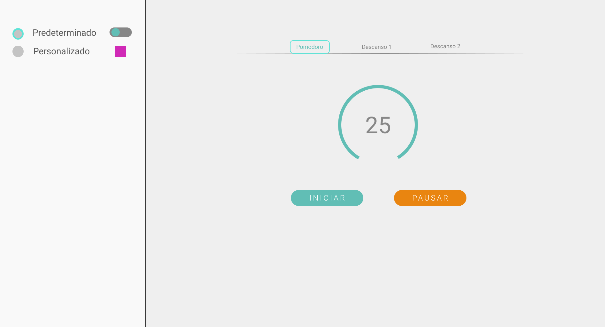
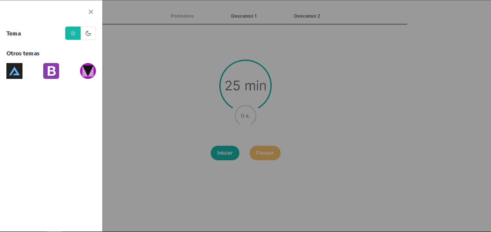

## Table of contents

- [Overview](#overview)
  - [The challenge](#the-challenge)
  - [Figma](#figma)
  - [Solution](#solution)
  - [Links](#links)
- [My process](#my-process)
  - [Built with](#built-with)
  - [Process](#process)
  - [Colors and fonts](#useful-resources)


## Overview

### The challenge
Pomodoro App.

Requeriments:

- Build a timer.
- Pause button.
- Two additional timers.
- Circular progress bar around the timer.
- Set two present themes.
- Set a theme customizer.


- Estimated development time: 48 hrs.

Real development time: 24 hrs.

- Estimated build time: 30 seg.

Real time of build: 24 seg.

### Figma



### Solution




### Links

- Solution URL: [Pomodoro App](https://pomodor-app.herokuapp.com/)

## My process

### Built with

- Semantic HTML5 markup
- CSS custom properties
- PimeNG
- Desktop-first workflow
- [Angular](https://angular.io/) - Angular framework


### Process
#### Get started

First we are going to create a new angular application.

```shell
ng new pomodoro
```
To work with the styles and the dynamic elements we use PrimeNg, so we will do the installation.

```shell
npm install primeng primeicons
```
The configuration process of PrimeNg can be found on its official page at the following link:
[PrimeNG](https://primefaces.org/primeng/showcase/#/setup)

Now, within the application we will create a new module with the following command:

```shell
ng g m primeNg
```

The function of this module is to import and export the PrimeNG own modules that are required, it is a way to better organize the code.
This will look something like this:

```js
import { NgModule } from '@angular/core';
import { CommonModule } from '@angular/common';
import {ButtonModule} from 'primeng/button';
import {StyleClassModule} from 'primeng/styleclass';
import {KnobModule} from 'primeng/knob';
import {SidebarModule} from 'primeng/sidebar';
import {SelectButtonModule} from 'primeng/selectbutton';


@NgModule({
  declarations: [],
  imports: [
    CommonModule
  ],
  exports:[
    ButtonModule,
    StyleClassModule,
    KnobModule,
    SidebarModule,
    SelectButtonModule

  ]
})
export class PrimeNGModule { }

```
#### Pomodoro Component

The pomodoro component will be the main timer, it will also have two buttons, one to start the timer and one to pause it. So we created it as follows:

```shell
ng g c pages/pomodoro --skip-tests

```
Inside pomodoro.component.html we will have the following structure, using a PrimeNG module we can represent a timer with the <p-knob> tag. We will use two timers,  one to represent the minutes and the other to represent the seconds.


```html
  <p-knob [(ngModel)]="minutes" valueTemplate="{value} min" [strokeWidth]="2" [size]="200" [max]="25" [readonly]="true" class="mt-8 mb-0">
  </p-knob>

  <p-knob [(ngModel)]="seconds" valueTemplate="{value} s." [strokeWidth]="5" [size]="80" [max]="60" [readonly]="true" class="seg mt-0"></p-knob>

```

Within the same file we will add two buttons to start and pause the timer.

```html
  <p-button type="button" label="Iniciar" (onClick)="startTimer()" [class]="iniciar" styleClass="p-button-rounded mr-3" ></p-button>

  <p-button type="button" label="Pausar" (onClick)="pauseTime()" [class]="pausar" styleClass="p-button-rounded ml-3 p-button-warning"></p-button>

```

We created a function called startTimer and inside it using a setInterval we create our timer.

```js

  minutes: number = 25;
  seconds: number = 0
  interval: any = 0;
  padLeft = (n: string | any[]) => "00".substring(0, "00".length - n.length) + n;
  date = new Date('2021-12-13 00:25');

  startTimer() {
   
      this.interval = setInterval(() => {
        this.minutes = Number(this.padLeft(this.date.getMinutes() + "")) ;
        this.seconds = Number(this.padLeft(this.date.getSeconds() + "")) ;
        this.date = new Date(this.date.getTime() - 1000);

      },1000)

  }
```

This function will be started each time the "Iniciar" button is pressed, and to pause the timer we will use the following:

```js

iniciar: string = "";
pausar: string = "p-disabled";

  pauseTime(){
    this.iniciar = "";
    this.pausar= "p-disabled";
    clearInterval(this.interval);
  }

  clear(){
    clearInterval(this.interval);
  }
```

the "iniciar" and "pausar" properties are used to enabled and disable the buttons, depending on what state they are in. We added two audio functions to notify when the start button is pressed, as well as when the time is up.

```js
  playAudio(){
    let audio = new Audio();
    audio.src = "../../../assets/sound/sound.mp3";
    audio.load();
    audio.play();
  }

  playStart(){
    let audio = new Audio();
    audio.src = "../../../assets/sound/click2.mp3";
    audio.load();
    audio.play();
  }

```
Finally, within the same startTimer function we add a conditional, if three short breaks have already been taken then we will navigate to the long break timer, otherwise we will take another short break.

```js
        if(this.minutes == 0 && this.seconds == 0){

          if(this.cycles % 4 == 0){
            this.playAudio();
            this.cycles ++;
            this.clearIntervalService.setCycles(this.cycles);
            this.clear();
            this._router.navigate(['/break2'])

          }else{
            this.playAudio();
            this.cycles ++;
            this.clearIntervalService.setCycles(this.cycles);
            this.clear();
            this._router.navigate(['break1'])

          }}
```


####  Break1 and Break2 components

Now we need to create two additional components to represent the short break and the long break respectively.

```shell
ng g c pages/break1 --skip-tests

```

```shell
ng g c pages/break2 --skip-tests

```

Both components will have the same structure as the pomodoro component, except that the conditional structure will determine that it must return to the pomodoro component timer in both cases when the timer ends.

```js
 if(this.minutes == 0 && this.seconds == 0){

          this.playAudio();
          this.clear();
          this._router.navigate([''])
        }
```


#### Routing Module

To be able to navigate from one component to another in an efficient way without reloading the whole page we will create a module to make use of the RouterModule offered by angular. We create it in root folder:

```shell
ng g m app-routing --skip-tests
```

And within this we declare the following, we create a constant that will be an object with the possible rotes that our application may have, as well the component that will be displayed for each route.

```js
import { NgModule } from "@angular/core";
import { RouterModule, Routes } from "@angular/router";
import { Break1Component } from "./pages/break1/break1.component";
import { Break2Component } from "./pages/break2/break2.component";
import { PomodoroComponent } from "./pages/pomodoro/pomodoro.component";


const routes : Routes = [
  {
    path: '',
    component: PomodoroComponent,
    pathMatch: 'full'
  },
  {
    path: 'break1',
    component: Break1Component
  },
  {
    path: 'break2',
    component: Break2Component
  },
  {
    path: '**',
    redirectTo: ''
  }
]

@NgModule({

  imports: [
    RouterModule.forRoot(routes)
  ],
  exports: [

    RouterModule
  ]
})


export class AppRoutingModule{}

```
That done, we now need a component that allows us to navigate between routes manually.


#### Menu Component 

To be able to navigate manually between the previously created routes it is necessary to create a menu, for this we create the following module:

```shell
ng g c shared/menu --skip-tests
```
Inside the menu.component.html we add three buttons, that using the routerLink we will be able to navigate to the established routes.

```html
      <p-button #first routerLink="" routerLinkActive="p-disabled" [routerLinkActiveOptions]="{exact: true}" type="button" label="Pomodoro"  styleClass="p-button-text p-button-sm p-button-plain" (onClick)="stopInterval()"></p-button>

      <p-button routerLink="break1" routerLinkActive="p-disabled" type="button" label="Descanso 1" styleClass="p-button-text mx-0 md:mx-8 lg:mx-8 p-button-sm p-button-plain" (onClick)="stopInterval()"></p-button>

      <p-button routerLink="break2" routerLinkActive="p-disabled" type="button" label="Descanso 2" styleClass=" p-button-text p-button-sm p-button-plain" (onClick)="stopInterval()"></p-button>
```
In addition, with the event (onClick) we call the following function found inside our .ts file.

```js
export class MenuComponent implements OnInit {

  constructor(private clearIntervalService: IntervalService ) { }

  ngOnInit(): void {
  }

  stopInterval(){
    this.clearIntervalService.clearInter();
  }

}
```

the service to be injected will be described as follows


#### interval service

This service is created with the necessity of being able to stop a timer in execution (setInterval) every time that a navigation is made with the menu, because otherwise the interval will continue executing although we are in another different route.

```shell
ng g s services/interval --skip-tests
```
We also use this service to store the number of cycles our timer has been running and use the value to determine whether to take a short break or a long break.

```js
import { Injectable } from '@angular/core';
import {  Subject } from 'rxjs';

@Injectable({
  providedIn: 'root'
})
export class IntervalService {

  private interval = new Subject<any>();
  public observerInterval$ = this.interval.asObservable();

  private cyclesService: number = 1;
  public cyclesService$ = this.cyclesService;

  constructor() { }


  clearInter(){
    this.interval.next(0);
  }


  setCycles(cycles: number){
    this.cyclesService = cycles;
  }

  getCycles(){
    return this.cyclesService;
  }
}
```
and the way to subscribe to this service from a module is as follows:

```js
  constructor(private clearIntervalService: IntervalService) { }

  ngOnInit(): void {
    this.cycles = this.clearIntervalService.getCycles();

    this.clearIntervalService.observerInterval$.subscribe(
      () => {
        this.clear();
      }
    )
  }
```

#### Configuration to change the theme

First, inside the src folder we create a file for each theme we want to add, e.g. arya-blue.scss
And inside that file we will do an @import of the theme we want to use.

```css
@import"primeng/resources/themes/arya-blue/theme.css"
```
Then in our index.html in the <head> we add the following:

```html
  <link id="app-theme" rel="stylesheet" type="text/css" href="lara-light-teal.css" >

```
with the id we can change the href with the help of a service.
In the angular.json we add the following in the "styles" section:

```json
              {
                "input": "src/bootstrap4-dark-blue.scss",
                "bundleName": "bootstrap4-dark-blue",
                "inject": false
              },
              {
                "input": "src/lara-light-teal.scss",
                "bundleName": "lara-light-teal",
                "inject": false
              },
              {
                "input": "src/arya-blue.scss",
                "bundleName": "arya-blue",
                "inject": false
              },
              {
                "input": "src/bootstrap4-light-purple.scss",
                "bundleName": "bootstrap4-light-purple",
                "inject": false
              },
              {
                "input": "src/md-dark-deeppurple.scss",
                "bundleName": "md-dark-deeppurple",
                "inject": false
              }
```
These are the themes that we will have available when required.


#### Theme service

We create the service with which we will be able to change the theme from another component.

```shell
ng g s services/theme
```
We will have the following

```js
import { DOCUMENT } from '@angular/common';
import { Inject, Injectable } from '@angular/core';

@Injectable({
  providedIn: 'root'
})
export class ThemeService {

  constructor(@Inject(DOCUMENT) private document: Document) { }


  switchTheme(theme: string){
    let themeLink = this.document.getElementById('app-theme') as HTMLLinkElement;

    if(themeLink){
      themeLink.href = theme + '.css';
    }
  }
}

```
The switchTheme function receives a string argument, which will be the name of the theme we want to select.


#### Sidebar Component 

The sidebar component will be charge of changing the theme.

```shell
ng g c shared/sidebar

```
We place a selector button that passes the event to a function called changeTheme() when the state changes.

```html
        <p-selectButton [options]="stateOptions" [(ngModel)]="obscuro" optionLabel="label" optionValue="value" (onOptionClick)="changeTheme($event)">

          <ng-template let-item>
            <i [class]="item.icon"></i>
          </ng-template>

        </p-selectButton>
```
In the side bar.component.ts we created the following properties and inject the service.

```js

  visibleSidebar1: boolean = false;
  stateOptions: any[];
  obscuro: boolean = false;

  constructor(private themeService: ThemeService) {

    this.stateOptions = [
      {
        icon: 'pi pi-sun',
        justify: 'Left',
        value: false,
      },
      {
        icon: 'pi pi-moon',
        justify: 'right',
        value: true
    }];

  }
```
And the function in charge of communicating with the service will be the following one.

```js
  changeTheme(evento: any){

    if(evento.option.value == false){
      this.themeService.switchTheme("lara-light-teal");
    }else{
      this.themeService.switchTheme("bootstrap4-dark-blue");

    }
  }
```
This passes required theme to the switchTheme function.


### Built with

Body:
- primary color: var(--surface-e)


Font:
- font-family: -apple-system, BlinkMacSystemFont, 'Segoe UI', Roboto, Oxygen, Ubuntu, Cantarell, 'Open Sans', 'Helvetica Neue', sans-serif;

