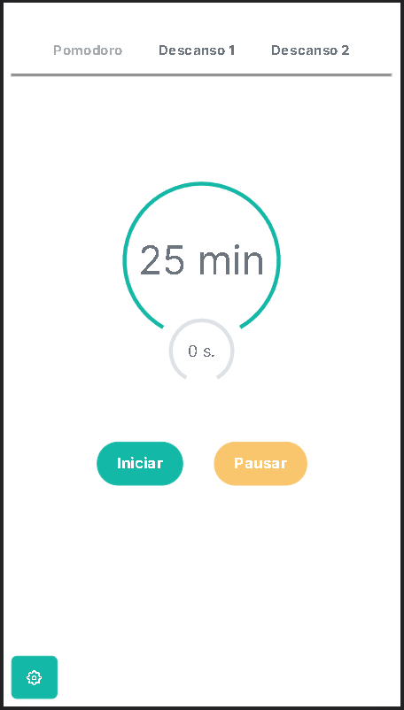

## Table of contents

- [Overview](#overview)
  - [The challenge](#the-challenge)
  - [Figma](#figma)
  - [Solution](#solution)
  - [Links](#links)
- [My process](#my-process)
  - [Built with](#built-with)
  - [Process](#process)
  - [Colors and fonts](#useful-resources)


## Overview

### The challenge
Pomodoro App.

Requeriments:

- Build a timer.
- Pause button.
- Two additional timers.
- Circular progress bar around the timer.
- Set two present themes.
- Set a theme customizer.


Estimated development time: 48 hrs.
Real development time: 24 hrs.

Estimated build time: 30 seg.
Real time of build: 24 seg.

### Figma


### Solution




### Links

- Solution URL: [Pomodoro App](https://pomodor-app.herokuapp.com/)

## My process

### Built with

- Semantic HTML5 markup
- CSS custom properties
- PimeNG
- Desktop-first workflow
- [Angular](https://angular.io/) - Angular framework


### Process
#### Get started

First we are going to create a new angular application.

```shell
ng new pomodoro
```
To work with the styles and the dynamic elements we use PrimeNg, so we will do the installation.

```shell
npm install primeng primeicons
```
The configuration process of PrimeNg can be found on its official page at the following link:
[PrimeNG](https://primefaces.org/primeng/showcase/#/setup)

Now, within the application we will create a new module with the following command:

```shell
ng g m primeNg
```

The function of this module is to import and export the PrimeNG own modules that are required, it is a way to better organize the code.
This will look something like this:

```js
import { NgModule } from '@angular/core';
import { CommonModule } from '@angular/common';
import {ButtonModule} from 'primeng/button';
import {StyleClassModule} from 'primeng/styleclass';
import {KnobModule} from 'primeng/knob';
import {SidebarModule} from 'primeng/sidebar';
import {SelectButtonModule} from 'primeng/selectbutton';


@NgModule({
  declarations: [],
  imports: [
    CommonModule
  ],
  exports:[
    ButtonModule,
    StyleClassModule,
    KnobModule,
    SidebarModule,
    SelectButtonModule

  ]
})
export class PrimeNGModule { }

```
#### Basic estructure
The basic structure of HTML is created as shown below:

```html
  <div class="container flex justify-content-center flex-wrap card-container">
    <div class="card">
      <div class="picture">
        <div class="pic">
          
        </div>
      </div>
      <div class="text">
        <p class="p1">Jorge Rivera</p>
        <p class="p2">Ing. Mecatrónico</p>
      </div>
      <div class="icons">
        <app-icon-add></app-icon-add>
      </div>

    </div>
  </div>

```

and the following styles are created in CSS for each of the classes assigned to each HTML element:

```css
.container{
  width: 100vw;
  height: 100vh;
  background: linear-gradient(to bottom, #477B7C, #1B3550);
  display: flex;
  align-items: center;
  justify-content: center;
  margin: auto;

  .card{
    width: 390px;
    height: 600px;
    background: linear-gradient(to bottom, #A1A1A1, #E3E3E3);
    border-radius: 5%;
    display: grid;
    grid-template-rows: 25% 25% 50%;
.picture{
  width: 100%;
  height: 100%;
  display: flex;
  justify-content: center;
  align-items: center;

  .pic{
    margin-top: 15%;
    width: 110px;
    height: 110px;
    border-radius: 50%;
    border: 4px solid #fff;
    overflow: hidden;
    img{
      width: 100%;
      height: 100%;
    }
  }
}
.text{
  margin-top: 10%;
  color: #fff;
  display: flex;
  align-content: center;
  align-items: center;
  justify-content: flex-start;
  flex-direction: column;

  .p1{
    font-size: 2.3rem;
    font-family: -apple-system, BlinkMacSystemFont, 'Segoe UI', Roboto, Oxygen, Ubuntu, Cantarell, 'Open Sans', 'Helvetica Neue', sans-serif;
  }
  .p2{
    font-size: 1.4rem;
    font-family: -apple-system, BlinkMacSystemFont, 'Segoe UI', Roboto, Oxygen, Ubuntu, Cantarell, 'Open Sans', 'Helvetica Neue', sans-serif;
  }
}
.icons{
  display: flex;
  justify-content: center;
  align-items: center;
  align-content: center;
}


  }
}

```
#### SpeedDial
Now we make use of the SpeedDial that primeNG offers us, but first we create a component for this with the following command.

```shell
ng g c icons/iconAdd
```
Inside icon-add.component.html we will have the following:

```html
<p-speedDial [model]="items" [radius]="radius" type="circle"></p-speedDial>

```

The previous tag is typical of primeNG to make use of the speedDial,
finally, inside icon-add.component.ts we will have the following code:
```js
import { Component, OnInit } from '@angular/core';
import { MenuItem, MessageService } from 'primeng/api';

@Component({
  selector: 'app-icon-add',
  templateUrl: './icon-add.component.html',
  styleUrls: ['./icon-add.component.scss']
})
export class IconAddComponent implements OnInit {

  items!: MenuItem[];
  radius: number = 80;

  constructor(private messageService: MessageService) { }

  ngOnInit(): void {
    this.items = [
      {
          icon: 'pi pi-facebook',
          url: 'https://www.facebook.com/jorgedejesus.riveraperez.1'

      },
      {
          icon: 'pi pi-instagram',
          url: 'https://www.instagram.com/jorge_de_jesus_r/?hl=es-la'

      },
      {
          icon: 'pi pi-whatsapp',
          url: 'https://api.whatsapp.com/send?phone=7621040098'

      },
      {
          icon: 'pi pi-github',
          url: 'https://github.com/JorgeR-Code'

      }

    ]
}
}

```

### Built with

Body:
- primary color: #477B7C
- second color: #1B3550

Card:
- primary color: #A1A1A1
- second color: #E3E3E3

Font:
- font-family: -apple-system, BlinkMacSystemFont, 'Segoe UI', Roboto, Oxygen, Ubuntu, Cantarell, 'Open Sans', 'Helvetica Neue', sans-serif;

